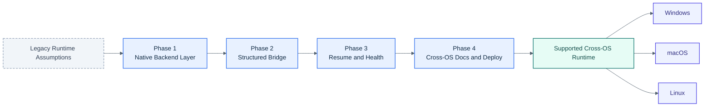

# Cross-OS Native Implementation Plan

## Visual Overview

## Goal
Rework Conductor so the core product works natively on Windows, macOS, and Linux without requiring Unix-only infrastructure in the main execution path. The project should keep its current shape as a Discord-based Claude Code session orchestrator, but platform-specific behavior must be isolated behind explicit adapters.

## Product Direction
- Discord remains the control plane and the user-facing session surface.
- Conductor remains a long-running Node.js service with SQLite persistence.
- Claude Code remains the execution engine.
- The core runtime must stop assuming `tmux`, Bun, Bash semantics, or Unix path/process behavior.

## Design Principles
- Cross-OS first: anything in the main runtime must behave on `win32`, `darwin`, and `linux`.
- Structured transport over screen scraping: prefer explicit message passing over parsing terminal output.
- Native platform adapters only at the edge: OS-specific process or service behavior belongs in dedicated modules or deploy scripts, not in orchestration logic.
- Node-only runtime: the main product should run with Node.js and project dependencies only.
- Documentation parity: every functional change that affects platform support must update user-facing docs in the same change.

## Target Architecture

### 1. Split Core Orchestration from Platform Backends
- Introduce a `TerminalBackend` abstraction in a new `src/terminal.ts`.
- Add a native PTY backend using `node-pty`:
  - Windows: ConPTY
  - macOS/Linux: PTY via `node-pty`
- Keep the current `tmux` code as a legacy Unix-only compatibility backend during migration, not as the default design target.
- All session creation, input, output capture, liveness, and termination must flow through the backend interface.

### 2. Replace the Polling Bridge with a Structured Bridge
- Promote the current Discord MCP/plugin path from backup to primary message transport.
- The structured bridge should carry:
  - Discord message to Claude input as explicit events
  - Claude reply to Discord output as explicit tool calls or callbacks
- Terminal capture should no longer be the source of truth for assistant replies.
- Terminal output remains useful only for:
  - process startup
  - readiness detection
  - trust/permission prompts
  - emergency diagnostics

### 3. Remove Bun from the Primary Path
- Rewrite `plugin/discord-autopair/server.ts` to run under Node.js.
- Remove Bun as a required dependency for the supported production path.
- Keep any Bun-specific workflow only if it remains optional and isolated from the supported install path.

### 4. Make Session Persistence Backend-Agnostic
- Session rows in SQLite must stop encoding transport assumptions in names and fields.
- Replace `tmux_session`-centric thinking with a generic session handle model:
  - logical session id
  - backend type
  - backend handle
  - Claude process pid if available
  - project directory
  - Discord channel ids
  - status and timestamps
- Resume, reconciliation, health monitoring, and checkpoint logic must operate through the backend interface, not direct `tmux` calls.

### 5. Simplify Resume and Recovery
- Prefer native Claude session continuity where available.
- Keep checkpoint-based recovery as a fallback for crashes or full system restarts.
- Resume flow must work regardless of backend:
  - PTY-backed live session still running: reattach
  - backend session gone but checkpoint exists: reconstruct
  - platform-specific backend unavailable: fail clearly and keep session resumable

### 6. Make Path, Shell, and Service Behavior Explicit
- Use `path.resolve`, `path.join`, `os.homedir`, and platform-aware shell selection everywhere.
- Never hard-code `/tmp`, `~/`, or POSIX path separators in runtime logic.
- Keep service deployment scripts separate by platform:
  - Linux: systemd
  - macOS: launchd
  - Windows: PM2 or equivalent documented process manager
- The runtime itself must not depend on how it is launched.

## Delivery Phases

### Phase 1: Introduce the Native Backend Layer
- Add `src/terminal.ts` and `src/terminal-pty.ts`.
- Update session spawn, liveness, kill, and capture paths to use the backend interface.
- Add `node-pty` and document native build prerequisites where needed.
- Keep `tmux` behind `TERMINAL_BACKEND=tmux` for Unix compatibility during migration.

### Phase 2: Promote the Structured Bridge
- Move Discord session traffic off pane polling and onto the MCP/plugin path.
- Disable pane-based reply extraction when structured transport is active.
- Ensure Discord replies come from structured Claude output, not terminal parsing.
- Convert the plugin runtime to Node and remove Bun from the default path.

### Phase 3: Unify Resume, Health, and Checkpoints
- Make `resume.ts`, `checkpoint.ts`, and `daemon.ts` backend-neutral.
- Replace direct `tmux` assumptions with backend calls everywhere.
- Keep startup reconciliation logic identical across OSes.

### Phase 4: Cross-OS Documentation and Deployment
- Rewrite README and SETUP so Windows, macOS, and Linux are first-class paths.
- Update `docs/architecture.md`, `docs/bridge.md`, `docs/deployment.md`, `docs/session-lifecycle.md`, and `docs/resume-and-recovery.md`.
- Add a documented Windows production path equal in quality to launchd/systemd.

## Acceptance Criteria
- A session can be created, used, killed, and resumed on Windows, macOS, and Linux.
- The supported install path does not require `tmux`.
- The supported install path does not require Bun.
- Discord-to-Claude replies do not depend on parsing terminal panes.
- Core runtime code contains no unguarded Unix-only assumptions.
- All platform-specific requirements are explicit in docs and env configuration.

## Non-Goals
- Perfect feature parity between the legacy `tmux` backend and the new structured bridge on day one.
- Preserving `tmux` as the long-term primary architecture.
- Supporting platform-specific shortcuts in core code when a cross-OS equivalent exists.

## Maintenance Rules
- New features must land in the backend interface or in backend-neutral orchestration layers, not as direct `tmux` additions.
- New docs must describe Windows, macOS, and Linux behavior unless the feature is explicitly platform-specific.
- Platform-specific code must be isolated and named as such.

## References
- Claude Code CLI reference: https://code.claude.com/docs/en/cli-reference
- Claude Channels reference: https://code.claude.com/docs/en/channels-reference
- Claude Agent SDK reference: https://platform.claude.com/docs/en/agent-sdk/typescript
- node-pty README: https://github.com/microsoft/node-pty
