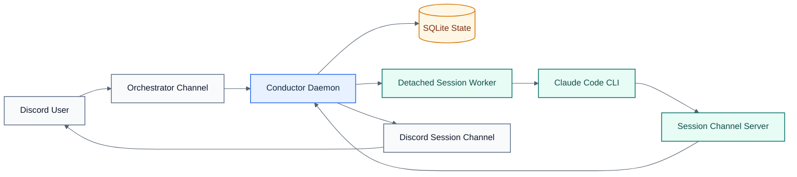

# Conductor

Conductor turns a Discord server into a multi-session Claude Code control plane. Each session gets its own Discord channel, a detached worker process, a persistent Claude Code session, and a structured Discord transport through Claude Channels.

## Visual Overview



## Supported Runtime

- Node.js 20+
- Claude Code v2.1.80+
- `claude.ai` authentication for Claude Code
- Discord bot with message content intent enabled

The supported path is:

- Claude Code CLI
- detached session workers
- `node-pty` for the terminal backend
- a custom Node MCP channel server for Discord transport

`tmux` is legacy and optional. Bun is optional and not required for the supported path.

## Install

```bash
git clone <repo-url> conductor
cd conductor
npm install
cp .env.example .env
```

Fill in `DISCORD_BOT_TOKEN`, `DISCORD_CLIENT_ID`, and `DISCORD_GUILD_ID`, then make sure Claude Code is already authenticated:

```bash
claude
```

If `/` is already reserved by another bot in your server, set `COMMAND_PREFIX` in `.env` to something else such as `!` or `cc!`.

## Run

Development:

```bash
npm run dev
```

Production:

- macOS: `scripts/com.conductor.plist`
- Linux: `scripts/conductor.service`

See [SETUP.md](/mnt/d/Repositories/cc-conductor/SETUP.md) and [docs/deployment.md](/mnt/d/Repositories/cc-conductor/docs/deployment.md).

## Upgrade Notes

- Conductor now fails fast if `CLAUDE_BIN` resolves to Claude Code older than `2.1.80`.
- If you are upgrading from the legacy tmux-backed DB schema and startup reports `sessions.tmux_session` is still `NOT NULL`, delete `data/conductor.db`, `data/conductor.db-shm`, and `data/conductor.db-wal`, then restart.

## Commands

All commands are issued in the channel named by `ORCHESTRATOR_CHANNEL_NAME` (default `#orchestrator`).

Set `COMMAND_PREFIX` to change the control-plane prefix. The examples below use `<prefix>` as a placeholder; with the default config, `<prefix>` is `/`.

| Command | Description |
|---------|-------------|
| `<prefix>new <name> [dir]` | Start a new Claude Code session and create a matching Discord channel |
| `<prefix>list` | List sessions and statuses |
| `<prefix>kill <name>` | Kill a session |
| `<prefix>resume [name]` | Resume an interrupted session |
| `<prefix>add-dir <session> <path>` | Allow an extra directory for a session and restart it to apply access |
| `<prefix>mode default <off\|typing>` | Set the global typing indicator mode |
| `<prefix>mode <session> <off\|typing\|reset>` | Set per-session typing indicator |
| `<prefix>help` | Show command reference |

## Architecture

Conductor now has three runtime roles:

- The main daemon owns the Discord bot, REST API, DB, routing, reconciliation, and health monitoring.
- Each session runs in a detached worker that owns the persistent Claude Code process.
- Claude replies travel through a custom Node channel server over Claude Channels instead of terminal pane scraping.

Copy `.env.example` to `.env` and fill in the required values:

```env
# Required — from Discord Developer Portal
DISCORD_BOT_TOKEN=           # Bot tab → Token
DISCORD_CLIENT_ID=           # OAuth2 tab → Client ID
DISCORD_GUILD_ID=            # Right-click server → Copy Server ID

# Optional — sensible defaults
ORCHESTRATOR_CHANNEL_NAME=orchestrator
CONDUCTOR_API_PORT=7842
DEFAULT_WORK_DIR=~/projects
MAX_SESSIONS=10
SESSION_IDLE_TIMEOUT_MINS=120
CHECKPOINT_INTERVAL_MINS=15
CHECKPOINT_DISCORD_MESSAGES=50
AUTO_RESUME_ON_START=false
ARCHIVE_ON_KILL=true
CLAUDE_BIN=claude
INDICATOR_MODE=typing
```

## Session Resumability

Conductor handles three recovery paths:

1. Daemon restart: workers keep running and reconnect to the restarted daemon.
2. Worker or Claude exit: the session is marked interrupted and can be resumed.
3. Full machine restart: `<prefix>resume` first attempts Claude CLI resume, then falls back to Conductor checkpoint injection.

## Notes

- The supported structured transport currently depends on Claude Channels research-preview behavior and the development channel flag.
- Conductor keeps a single Discord gateway client in the daemon. Session workers and channel servers talk back to it over localhost-authenticated internal routes.
- Core runtime code is backend-neutral; platform-specific deployment remains outside the runtime.
- Worker startup diagnostics are written under `data/sessions/<sessionId>/`.
