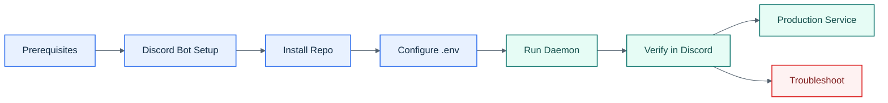

# Conductor Setup

## Visual Overview



## 1. Prerequisites

Install:

| Dependency | Minimum | Check |
|------------|---------|-------|
| Node.js | 20+ | `node -v` |
| Claude Code | v2.1.80+ | `claude --version` |

Optional:

| Dependency | Purpose |
|------------|---------|
| `tmux` | Legacy backend only |
| Bun | Optional for legacy plugin experiments only |

Claude Code must already be authenticated with a `claude.ai` account:

```bash
claude
```

Conductor rejects Claude Code older than `2.1.80` at startup.

## 2. Discord Bot

Create a bot in the Discord Developer Portal and enable:

- Message Content Intent

Grant at least:

- Manage Channels
- Send Messages
- Read Message History
- Add Reactions

Collect:

- `DISCORD_BOT_TOKEN`
- `DISCORD_CLIENT_ID`
- `DISCORD_GUILD_ID`

## 3. Install

```bash
git clone <repo-url> conductor
cd conductor
npm install
cp .env.example .env
```

## 4. Configure

Required:

```env
DISCORD_BOT_TOKEN=...
DISCORD_CLIENT_ID=...
DISCORD_GUILD_ID=...
```

Important defaults:

```env
ORCHESTRATOR_CHANNEL_NAME=orchestrator
COMMAND_PREFIX=/
CONDUCTOR_API_PORT=7842
DEFAULT_WORK_DIR=~/projects
TERMINAL_BACKEND=pty
STRUCTURED_TRANSPORT=channel
SESSION_RECONNECT_GRACE_MS=15000
CLAUDE_BIN=claude
SESSION_IDLE_TIMEOUT_MINS=120
CHECKPOINT_INTERVAL_MINS=15
CHECKPOINT_DISCORD_MESSAGES=50
AUTO_RESUME_ON_START=false
ARCHIVE_ON_KILL=true
INDICATOR_MODE=typing
```

`TERMINAL_BACKEND=pty` is the supported path. `tmux` is legacy only.

`STRUCTURED_TRANSPORT=channel` is the supported path. It uses a generated Node MCP channel server and the Claude development-channel flag internally.

Set `COMMAND_PREFIX` if `/` is already claimed by another bot. For example, `COMMAND_PREFIX=!` makes the control-plane commands `!help`, `!new`, and so on.

If you are upgrading from the legacy tmux-backed schema and startup reports `sessions.tmux_session` is still `NOT NULL`, delete `data/conductor.db`, `data/conductor.db-shm`, and `data/conductor.db-wal` before restarting.

## 5. Run

Development:

```bash
npm run dev
```

Expected startup shape:

```text
[YYYY-MM-DD HH:MM:SS] [INFO] Conductor starting...
[YYYY-MM-DD HH:MM:SS] [INFO] Discord bot logged in as ...
[YYYY-MM-DD HH:MM:SS] [INFO] Daemon listening on 127.0.0.1:7842
[YYYY-MM-DD HH:MM:SS] [INFO] Conductor is fully operational.
```

## 6. Verify

1. Open your Discord server.
2. Confirm the `Conductor` category and the channel named by `ORCHESTRATOR_CHANNEL_NAME` exist (default `#orchestrator`).
3. Run `<prefix>help` (default `/help`).
4. Run `<prefix>new test-session` (default `/new test-session`).
5. Confirm a `#test-session` channel appears and Claude replies arrive in Discord.

## 7. Production

- macOS: use [scripts/com.conductor.plist](/mnt/d/Repositories/cc-conductor/scripts/com.conductor.plist)
- Linux: use [scripts/conductor.service](/mnt/d/Repositories/cc-conductor/scripts/conductor.service)

The daemon can restart without terminating live session workers.

## Troubleshooting

| Problem | Fix |
|---------|-----|
| Missing required environment variable | Fill in the three required Discord values |
| Bot does not respond | Verify token, guild ID, invite permissions, and Message Content Intent |
| `claude` not found | Set `CLAUDE_BIN` to the absolute Claude Code path |
| Sessions start but do not answer | Verify Claude Code is authenticated and Channels are available in your Claude Code environment |
| Session falls back to PTY | The structured channel server is disconnected; inspect daemon logs and worker state under `data/sessions/<id>/` |
| Startup fails on Claude version | Upgrade Claude Code to `2.1.80+` and confirm `claude --version` |
| Startup fails on `tmux_session` schema | Delete `data/conductor.db`, `data/conductor.db-shm`, and `data/conductor.db-wal`, then restart |
| Port 7842 already in use | Change `CONDUCTOR_API_PORT` |

## Automation Checklist

1. Check `node -v` and `claude --version`.
2. Run `npm install`.
3. Copy `.env.example` to `.env`.
4. Fill in the Discord credentials.
5. Ensure Claude Code is authenticated.
6. Run `npm run dev`.
7. Test `<prefix>help` and `<prefix>new test-session` with your configured prefix.
