# Conductor Docs

## Visual Overview

```mermaid
%%{init: {'theme':'base','themeVariables': {'background':'#ffffff','primaryColor':'#E8F1FF','primaryTextColor':'#102A43','primaryBorderColor':'#2F6FED','lineColor':'#52606D','secondaryColor':'#E6FCF5','tertiaryColor':'#FFF4E6','fontFamily':'Segoe UI, Arial, sans-serif'}}}%%
flowchart TD
    Docs[Conductor Docs] --> Runtime[Architecture and Bridge]
    Docs --> Lifecycle[Lifecycle and Recovery]
    Docs --> Ops[Setup Deployment Config]
    Docs --> Interfaces[Commands API Typing]
    Docs --> Recovery[Checkpoints and Health]

    Runtime --> Arch[architecture.md]
    Runtime --> Bridge[bridge.md]
    Runtime --> Plugin[mcp-plugin.md]
    Lifecycle --> Session[session-lifecycle.md]
    Lifecycle --> Resume[resume-and-recovery.md]
    Ops --> Config[configuration.md]
    Ops --> Deploy[deployment.md]
    Interfaces --> Commands[commands.md]
    Interfaces --> Api[rest-api.md]
    Interfaces --> Typing[typing-indicator.md]
    Recovery --> Checkpoints[checkpoints.md]
    Recovery --> Health[health-monitoring.md]

    classDef root fill:#E8F1FF,stroke:#2F6FED,color:#102A43,stroke-width:1.5px;
    classDef group fill:#E6FCF5,stroke:#0F766E,color:#134E4A,stroke-width:1.5px;
    classDef page fill:#EEF2FF,stroke:#4F46E5,color:#312E81,stroke-width:1.5px;

    class Docs root;
    class Runtime,Lifecycle,Ops,Interfaces,Recovery group;
    class Arch,Bridge,Plugin,Session,Resume,Config,Deploy,Commands,Api,Typing,Checkpoints,Health page;
```

- [Architecture](./architecture.md): daemon, session worker, and channel server roles
- [Commands](./commands.md): Discord control-plane commands and prefix settings
- Sessions can now gain extra allowed directories through `<prefix>add-dir`, without changing their base `projectDir`
- Startup failures in Discord are shortened to fit Discord message limits and point to worker diagnostics under `data/sessions/<sessionId>/`
- [Bridge](./bridge.md): structured Discord transport and PTY fallback
- [Session Lifecycle](./session-lifecycle.md): spawn, active, interruption, kill
- [Resume & Recovery](./resume-and-recovery.md): reconnect, Claude resume, checkpoint fallback
- [Configuration](./configuration.md): environment variables
- [Deployment](./deployment.md): service setup notes
- [Checkpoints](./checkpoints.md): what gets persisted for recovery
- [Health Monitoring](./health-monitoring.md): worker heartbeat and idle handling
- [REST API](./rest-api.md): daemon endpoints
- [MCP Plugin](./mcp-plugin.md): legacy experimental plugin path
- [Typing Indicator](./typing-indicator.md): `<prefix>mode` behavior
