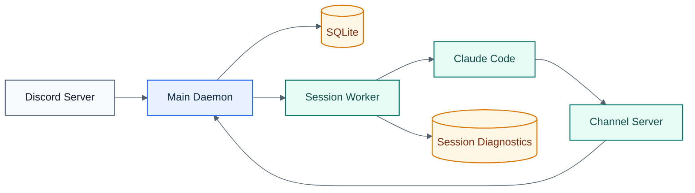

# Architecture

Conductor has three runtime roles.

## Visual Overview

## 1. Main Daemon

The main daemon owns:

- the Discord bot client
- the localhost REST API
- SQLite persistence
- startup compatibility checks for the DB schema and Claude Code version
- session reconciliation
- health monitoring
- checkpoint scheduling
- internal localhost routes for workers and channel servers

The daemon is the only Discord gateway client in the system.

## 2. Session Worker

Each session runs in a detached worker process. The worker owns:

- the persistent Claude Code process
- the terminal backend, with `node-pty` as the supported default
- startup readiness detection
- the session root plus any persisted `additionalDirs`
- development-channel consent auto-accept flow while leaving Claude trust and permission prompts interactive
- outside-directory prompt rejection and user-visible blocked-path notices
- session-local worker and terminal diagnostics under `data/sessions/<sessionId>/`
- local worker control endpoints for fallback input and shutdown

Workers survive daemon restarts and reconnect to the daemon over localhost.

## 3. Channel Server

Each Claude session loads a generated Node MCP channel server through Claude Code. The channel server:

- declares `claude/channel`
- is registered in Claude's local MCP scope for the session project before launch
- is selected through Claude's development channel loader: `--dangerously-load-development-channels server:<session-server-name>`
- launches through the Conductor repo's own resolved `tsx` loader path, not the session project's cwd
- long-polls the daemon for inbound Discord messages
- emits `notifications/claude/channel` into the live Claude session
- exposes `reply` and `react` tools that call back into the daemon

This is the source of truth for Claude replies in the supported path.

## Transport Rules

- Inbound Discord message:
  - first choice: structured channel event
  - fallback: PTY raw input if the channel transport is disconnected
- Outbound Claude reply:
  - only through the channel server `reply` / `react` tools

Conductor no longer depends on pane scraping to mirror Claude replies.

## Persistence Model

SQLite stores generic runtime state:

- worker identity
- terminal backend and handle
- transport kind and state
- Claude session name and resume reference
- lifecycle status and timestamps
- checkpoint path and resume count

Legacy `tmux_session` is kept only for compatibility.

Legacy DB files with `tmux_session NOT NULL` are rejected at startup rather than migrated in place.
