# Message Bridge

The supported bridge is structured, not scraped.

## Visual Overview

```mermaid
%%{init: {'theme':'base','themeVariables': {'background':'#ffffff','primaryColor':'#E8F1FF','primaryTextColor':'#102A43','primaryBorderColor':'#2F6FED','lineColor':'#52606D','secondaryColor':'#E6FCF5','tertiaryColor':'#FFF4E6','fontFamily':'Segoe UI, Arial, sans-serif'}}}%%
flowchart LR
    Msg[Discord Message] --> Transport{Channel Connected?}
    Transport -->|Yes| Queue[Daemon Event Queue]
    Queue --> Channel[Channel Server]
    Channel --> Claude[Claude Session]
    Claude --> Reply[reply or react tool]
    Reply --> Daemon[Daemon Bot Client]
    Daemon --> Discord[Discord Output]

    Transport -->|No| Pty[PTY Fallback Input]
    Pty --> Worker[Session Worker]
    Worker --> Warn[Fallback Warning]

    classDef edge fill:#F8FAFC,stroke:#64748B,color:#0F172A,stroke-width:1.5px;
    classDef control fill:#E8F1FF,stroke:#2F6FED,color:#102A43,stroke-width:1.5px;
    classDef runtime fill:#E6FCF5,stroke:#0F766E,color:#134E4A,stroke-width:1.5px;
    classDef warning fill:#FEF2F2,stroke:#DC2626,color:#7F1D1D,stroke-width:1.5px;

    class Msg,Discord edge;
    class Transport,Queue,Daemon control;
    class Channel,Claude,Reply,Worker runtime;
    class Pty,Warn warning;
```

## Primary Path

For active sessions with a connected channel server:

1. A Discord message arrives in a session channel.
2. Conductor registers a session-specific local-scope MCP server in Claude Code for that project.
3. The daemon queues a `notifications/claude/channel` event for that session.
4. Claude launches with the session's persisted `additionalDirs` as `--add-dir` arguments.
5. Claude loads the registered channel server through `--dangerously-load-development-channels server:<session-server-name>`.
6. The session channel server long-polls the daemon and forwards the event into Claude Code.
7. Claude replies by calling the channel server `reply` or `react` tool.
8. The channel server posts that tool call back to the daemon.
9. The daemon sends the reply or reaction through the Discord bot.

Claude replies do not come from terminal capture in this path.
The registered local-scope server pins the repo-local `tsx` loader by absolute path so channel startup does not depend on the session project's current working directory.
Worker readiness is held behind Claude's startup gates: folder trust, development-channel consent, and Claude approval prompts must clear before the session is treated as ready, and the worker only auto-confirms the development-channel consent prompt before marking ready once Claude's live session UI is visible.
If Claude requests access outside the session root plus `additionalDirs`, the worker dismisses that approval prompt and the daemon posts an explicit Discord notice instead of leaving the session hanging.

## PTY Fallback

If the structured channel server is disconnected:

1. The daemon sends raw input to the session worker.
2. The session is marked `transport_state=degraded`.
3. Discord receives a warning that fallback is active.

Fallback input exists for emergencies only. It is not the supported mirrored reply path.

## Typing Indicator

The daemon starts the Discord typing indicator when a user message is forwarded and stops it when a channel reply is received.

Global and per-session indicator settings still use `<prefix>mode`. With the default config, `<prefix>` is `/`.

Worker startup and terminal diagnostics for the fallback path are written under `data/sessions/<sessionId>/`.
