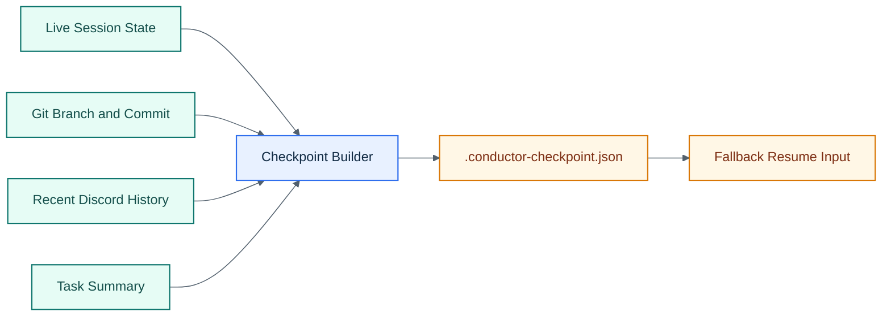

# Checkpoints

Checkpoints are daemon-owned recovery snapshots written to `.conductor-checkpoint.json` in the project directory.

## Visual Overview

Each checkpoint stores:

- session ID and name
- project directory
- timestamp
- current git branch
- latest git commit
- inferred task summary from recent Discord traffic
- recent Discord messages

Checkpoints no longer depend on terminal pane scraping.
