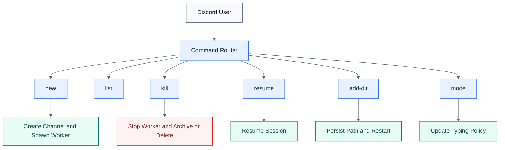

# Commands

All commands are issued in the channel named by `ORCHESTRATOR_CHANNEL_NAME` (default `#orchestrator`).

Set `COMMAND_PREFIX` to change the control-plane prefix. The examples below use `<prefix>` as a placeholder; with the default config, `<prefix>` is `/`.

## Visual Overview

## `<prefix>new <name> [dir]`

- Creates a Discord session channel
- Creates a DB record
- Spawns a detached session worker
- Launches Claude Code with a stable session name
- Loads the generated Discord channel server when structured transport is enabled
- If startup fails, the orchestrator reply includes a shortened diagnostic summary and the relevant worker log paths

## `<prefix>list`

Shows current sessions, status, project dir, age, and last activity.

## `<prefix>kill <name>`

- Stops the session worker
- Clears daemon-side transport state
- Archives or deletes the Discord channel depending on `ARCHIVE_ON_KILL`
- Deletes the session record

## `<prefix>resume [name]`

Without a name, lists interrupted sessions.

With a name, resume order is:

1. Claude CLI resume using the stable Conductor session name
2. Conductor checkpoint fallback with resume prompt injection

## `<prefix>add-dir`

- In `#orchestrator`: `<prefix>add-dir <session> <path>`
- In a session channel: `<prefix>add-dir <path>`
- Persists an extra allowed directory for that session
- Restarts the session so Claude relaunches with `--add-dir <path>`
- If Claude later asks for a path outside the allowed set, Conductor posts an explicit notice instead of leaving the session hanging on the approval prompt

## `<prefix>mode`

Controls the Discord typing indicator globally or per session.
