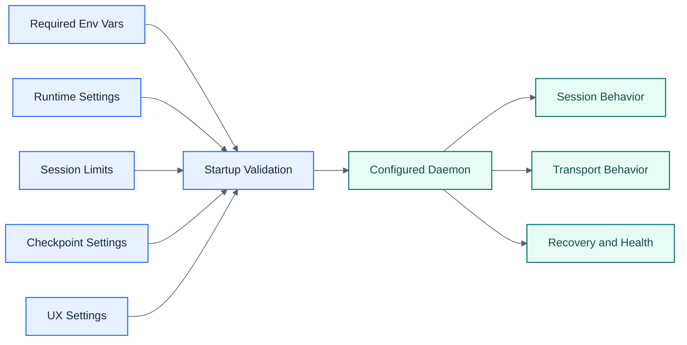

# Configuration

## Visual Overview

## Required

| Variable | Description |
|----------|-------------|
| `DISCORD_BOT_TOKEN` | Discord bot token |
| `DISCORD_CLIENT_ID` | Discord application client ID |
| `DISCORD_GUILD_ID` | Discord guild ID Conductor manages |

## Runtime

| Variable | Default | Description |
|----------|---------|-------------|
| `CONDUCTOR_API_PORT` | `7842` | Local daemon port |
| `DEFAULT_WORK_DIR` | `~/projects` | Base working directory for new sessions |
| `CLAUDE_BIN` | `claude` | Claude Code executable path |
| `TERMINAL_BACKEND` | `pty` | `pty` is the supported backend, `tmux` is legacy only |
| `STRUCTURED_TRANSPORT` | `channel` | `channel` enables the generated Claude channel server, `off` disables it |
| `SESSION_RECONNECT_GRACE_MS` | `15000` | How long startup waits for live workers to reconnect before reconciliation |

## Session Limits

| Variable | Default | Description |
|----------|---------|-------------|
| `MAX_SESSIONS` | `10` | Max concurrent active sessions |
| `SESSION_IDLE_TIMEOUT_MINS` | `120` | Idle timeout, `0` disables |
| `AUTO_RESUME_ON_START` | `false` | Automatically resume interrupted sessions on daemon startup |
| `ARCHIVE_ON_KILL` | `true` | Archive killed channels instead of deleting them |

## Checkpoints

| Variable | Default | Description |
|----------|---------|-------------|
| `CHECKPOINT_INTERVAL_MINS` | `15` | Periodic checkpoint cadence, `0` disables |
| `CHECKPOINT_DISCORD_MESSAGES` | `50` | Number of recent Discord messages to capture |

## UX

| Variable | Default | Description |
|----------|---------|-------------|
| `ORCHESTRATOR_CHANNEL_NAME` | `orchestrator` | Control-plane channel name |
| `COMMAND_PREFIX` | `/` | Prefix for text commands in the orchestrator channel and session-channel `mode` commands |
| `INDICATOR_MODE` | `typing` | Global typing indicator mode |

## Notes

- The supported path uses a generated Node MCP server with Claude’s development-channel flag.
- `tmux` and Bun are optional only. They are not required for the supported runtime.
- `COMMAND_PREFIX` must not contain whitespace. Invalid values fall back to `/`.
- Conductor validates `CLAUDE_BIN` at startup and requires Claude Code `2.1.80+`.
- Legacy databases with `sessions.tmux_session NOT NULL` must be reset manually by deleting `data/conductor.db`, `data/conductor.db-shm`, and `data/conductor.db-wal`.
