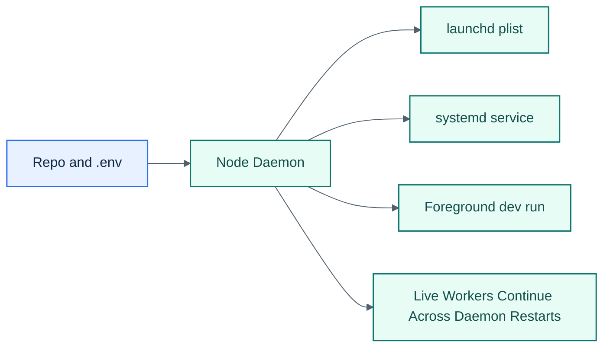

# Deployment

## Visual Overview

## Runtime Requirements

- Node.js 20+
- Claude Code installed and authenticated with `claude.ai`

Optional only:

- `tmux` for the legacy backend
- Bun for legacy plugin experiments

## Important Behavior

The daemon can restart without killing session workers. That means service restarts are less disruptive than in the old tmux-owned architecture.

## Service Files

- macOS: [scripts/com.conductor.plist](/mnt/d/Repositories/cc-conductor/scripts/com.conductor.plist)
- Linux: [scripts/conductor.service](/mnt/d/Repositories/cc-conductor/scripts/conductor.service)

Keep the runtime itself cross-platform. OS-specific behavior belongs in the service layer, not the shared runtime.
