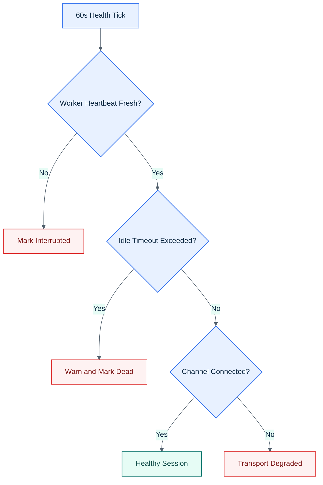

# Health Monitoring

The daemon checks active sessions every 60 seconds.

## Visual Overview

## Worker Health

The primary liveness signal is the worker heartbeat. If a worker is missing or stale beyond the configured threshold, the session is marked interrupted.
Claude workers also self-interrupt if an unknown blocking modal persists for 30 seconds, so prompt/UI drift does not leave a session heartbeating forever while stuck.
Workers whose runtime build id is missing or mismatched are treated as stale immediately and are interrupted instead of being considered healthy.
If a stale worker does not accept authenticated shutdown anymore, CC Conductor falls back to terminating the local worker PID.

## Idle Timeout

If `SESSION_IDLE_TIMEOUT_MINS` is non-zero and the session exceeds that idle window:

- the daemon posts a warning to the Discord channel
- the worker is stopped
- the session is marked `dead`

## Transport Health

Channel connectivity is tracked separately from worker liveness. If the channel server disconnects, the session can temporarily fall back to PTY input while remaining alive.
