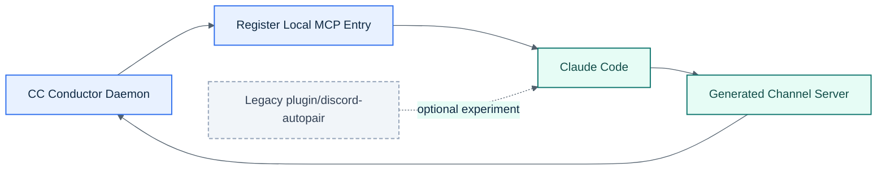

# CC Conductor MCP Plugin

CC Conductor’s supported structured path now uses the generated Node server in `src/channel-server.ts`.

The `plugin/discord-autopair/` directory is kept only as a legacy experimental reference. It is not the supported production path.

## Visual Overview

## Supported Path

- session-specific local-scope MCP entry in Claude's config for the active project
- session-scoped extra directory access applied through Claude `--add-dir` launch args, not through the channel server
- `node --import <repo-local tsx loader> src/channel-server.ts`
- Claude development channel selector: `--dangerously-load-development-channels server:<session-server-name>`
- daemon-owned Discord bot client
- localhost bearer-authenticated callbacks between the daemon and the channel server
- worker and terminal diagnostics under `data/sessions/<sessionId>/`

## Legacy Plugin Path

The plugin directory may still be useful for experimentation, but it is optional and not required for the main runtime.
