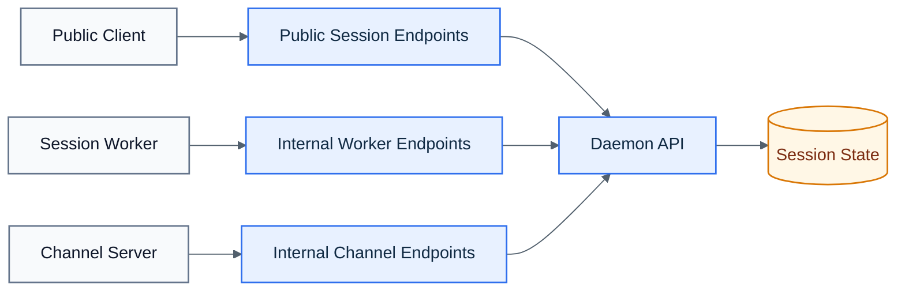

# REST API

The daemon listens on `127.0.0.1:${CONDUCTOR_API_PORT}`.

## Visual Overview

## Public Endpoints

- `POST /sessions/spawn`
- `DELETE /sessions/:id`
- `GET /sessions`
- `GET /sessions/:id`
- `POST /sessions/:id/ping`
- `POST /sessions/:id/resume`
- `POST /sessions/:id/add-dir`

## Internal Endpoints

These are localhost-only and require per-session bearer tokens:

- `POST /internal/sessions/:id/worker/register`
- `POST /internal/sessions/:id/worker/heartbeat`
- `POST /internal/sessions/:id/worker/notice`
- `POST /internal/sessions/:id/channel/register`
- `POST /internal/sessions/:id/channel/disconnect`
- `GET /internal/sessions/:id/channel/events`
- `POST /internal/sessions/:id/channel/reply`
- `POST /internal/sessions/:id/channel/react`

## Session Shape

Session payloads now describe generic runtime fields such as:

- `workerId`
- `terminalBackend`
- `terminalHandle`
- `transportKind`
- `transportState`
- `claudeSessionName`
- `claudeResumeRef`
- `workerStatus`

Legacy `tmuxSession` remains only for compatibility.
