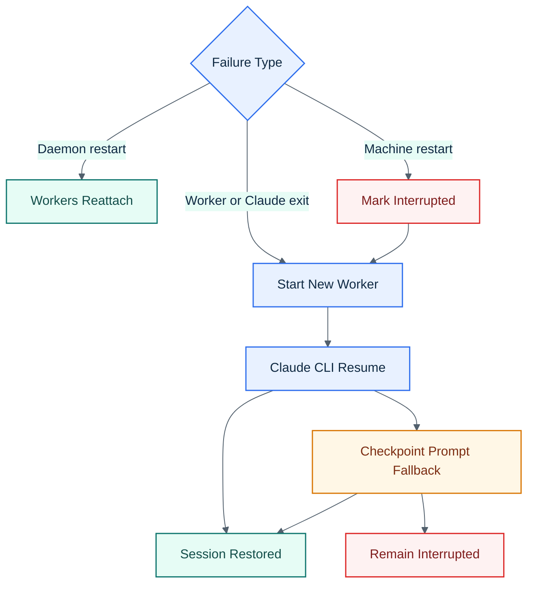

# CC Conductor Resume And Recovery

## Visual Overview

## Case 1: Daemon Restart, Workers Still Running

- The daemon starts its internal routes.
- Existing workers reconnect during the reconnect grace window.
- Reconciliation treats those sessions as live and reattaches them.

No session context is lost in this case.

## Case 2: Worker Or Claude Exit

- Health monitoring or worker heartbeat marks the session interrupted.
- `<prefix>resume <name>` starts a new worker.

Resume order:

1. `claude --resume <stable-session-name>`
2. If that fails, CC Conductor writes a resume prompt and injects it through the channel path

Each fresh worker spawn also re-registers the session-scoped local MCP entry before Claude launches, so resumes do not depend on stale `--mcp-config` state from previous workers.
The same restart/resume path is also used when CC Conductor needs to relaunch Claude with updated `--add-dir` access for an existing session.

If both resume paths fail, the session stays interrupted and the error points to the worker diagnostic files under `data/sessions/<sessionId>/`.

## Case 3: Full Machine Restart

- No workers survive.
- Reconciliation marks non-dead sessions interrupted.
- `<prefix>resume` follows the same CLI-resume then checkpoint-fallback flow.

Set `COMMAND_PREFIX` to change the prefix. With the default config, `<prefix>` is `/`.

CC Conductor also fails fast at startup if Claude Code is older than `2.1.80` or if the legacy DB schema still requires `tmux_session NOT NULL`.

## Resume Context

Checkpoint fallback includes:

- latest git branch and commit
- recent Discord history
- inferred task summary from the latest conversation

The resume prompt is written to `.conductor-resume-prompt.md` in the project directory and consumed on fallback resume.
