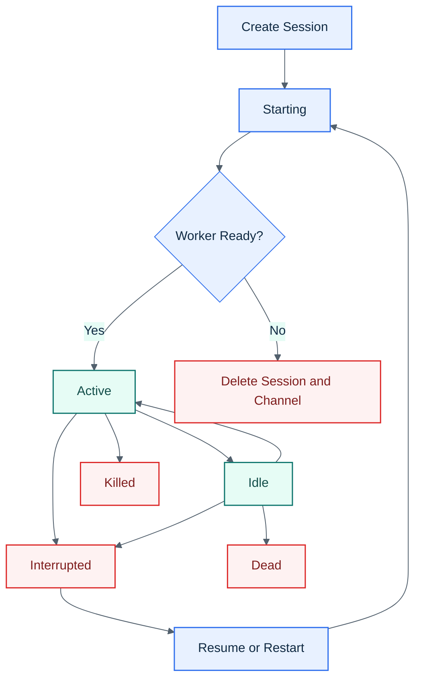

# CC Conductor Session Lifecycle

## Visual Overview

## States

`starting -> active -> idle -> dead`

`starting/active/idle -> interrupted -> resume -> starting`

## Spawn Flow

1. Validate the session name and concurrency limit.
2. Create the project directory if needed.
3. Create the Discord session channel.
4. Insert the session row with backend-neutral runtime fields.
5. Register the session channel server in Claude's local MCP scope for that project.
6. Spawn the detached worker.
7. Select the agent backend using `DEFAULT_AGENT_BACKEND` and `ENABLED_AGENT_BACKENDS`.
8. Worker launches the selected agent backend process through the chosen terminal backend.
9. Worker launches Claude with the session root and any persisted `additionalDirs`.
10. Worker auto-accepts trust, development channel, and Claude tool permission prompts if they appear, including the newer `Do you want to proceed?` approval dialog.
11. If Claude asks for access outside the allowed directories, the worker dismisses that prompt and posts a Discord notice explaining how to add the path explicitly.
12. If the worker does not reach ready, CC Conductor deletes the just-created session row and Discord channel, but keeps `data/sessions/<id>/` for diagnostics.
13. Worker reports readiness through the daemon internal route.
14. The daemon marks the session active and posts the ready notice.

## Active Behavior

- The worker keeps the Claude process alive.
- The channel server handles structured Discord traffic.
- The daemon tracks activity, transport state, and worker heartbeat.
- `<prefix>add-dir` persists a new allowed directory and restarts the session so the next Claude launch includes `--add-dir <path>`.

## Interruptions

A session becomes interrupted when:

- the worker exits
- the Claude process dies
- the daemon cannot reattach to a live worker during startup reconciliation

Failed resume attempts keep the session interrupted and surface the worker diagnostic path.

## Termination

`<prefix>kill` stops the worker, removes the session-scoped Claude MCP entry, clears runtime state, and archives or deletes the Discord channel.

With the default config, `<prefix>` is `/`.

Idle timeout marks the session `dead` and stops the worker.
