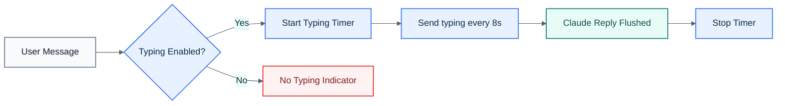

# Discord Typing Indicator

Shows "Conductor is typing..." in Discord while Claude Code is processing. Toggleable globally and per-session via the `<prefix>mode` command.

## Visual Overview

## How it works

When a user sends a message in a session channel, the bridge immediately calls `channel.sendTyping()` and repeats every 8 seconds (Discord's typing indicator lasts ~10s). The timer is cleared when the response is flushed to Discord, or when the bridge is stopped.

## Configuration

**Environment variable:** `INDICATOR_MODE` — set to `typing` (default) or `off`.

Set `COMMAND_PREFIX` to change the prefix. The examples below use `<prefix>` as a placeholder; with the default config, `<prefix>` is `/`.

**Runtime control via `<prefix>mode`:**

| Context | Command | Effect |
|---------|---------|--------|
| Orchestrator | `<prefix>mode` | Show current global mode |
| Orchestrator | `<prefix>mode default <off\|typing>` | Set global default |
| Orchestrator | `<prefix>mode <session> <off\|typing\|reset>` | Set per-session override |
| Session channel | `<prefix>mode` | Show current mode for this session |
| Session channel | `<prefix>mode <off\|typing\|reset>` | Set mode for this session |

`reset` clears the per-session override so it inherits the global default.

**Fallback chain:** session DB value → global in-memory setting → `INDICATOR_MODE` env var → `typing`

## Implementation

- `IndicatorMode` type and `indicatorMode` field on `Session` (`src/types.ts`)
- `indicator_mode` DB column, auto-migrated (`src/sessions.ts`)
- `startTypingIndicator()` / `stopTypingIndicator()` helpers (`src/bridge.ts`)
- `getIndicatorMode(session)` reads fresh from DB each call (`src/bridge.ts`)
- `<prefix>mode` command intercepted in session channels before relay (`src/bot.ts`)

## What's NOT included

- No streaming/progressive edits
- No message editing
- `extractResponse()` and `flushResponse()` logic is unchanged
